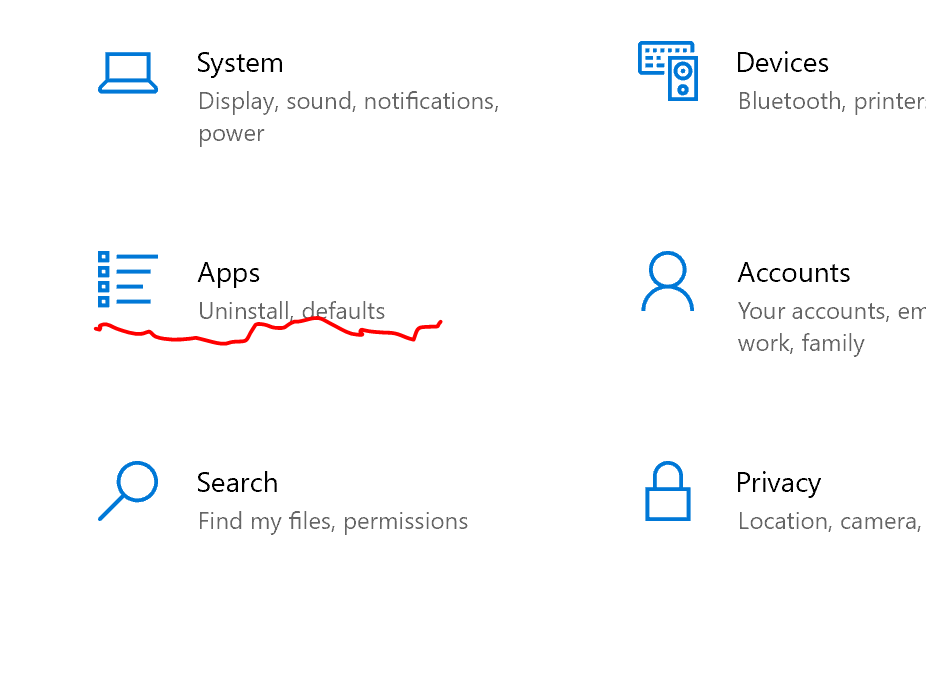
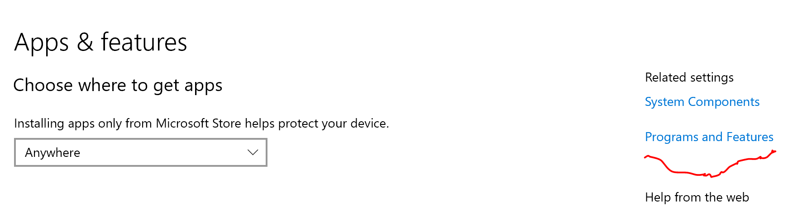
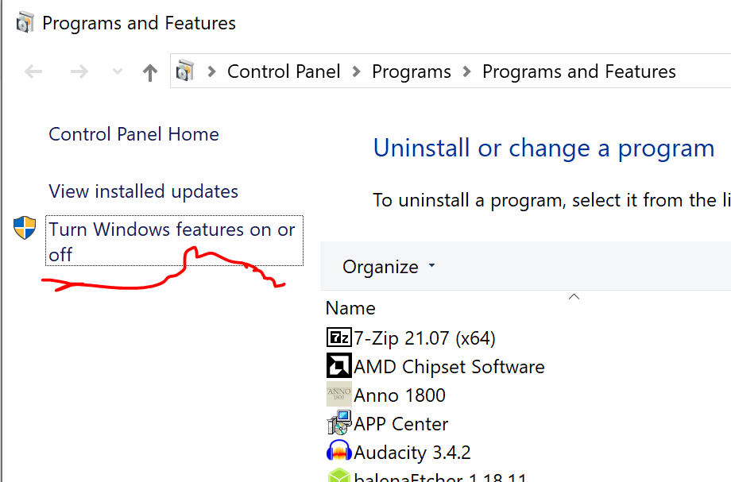
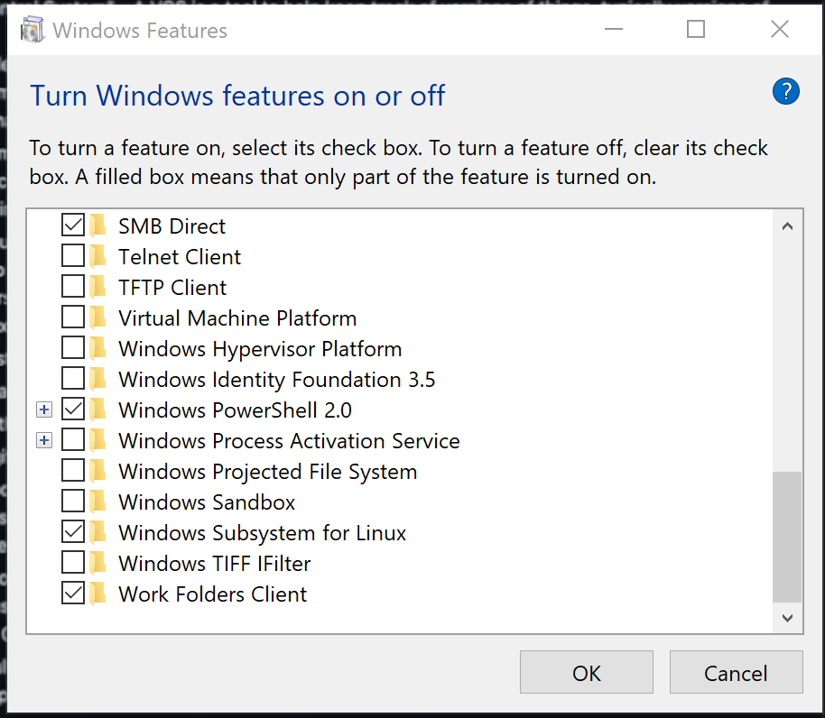
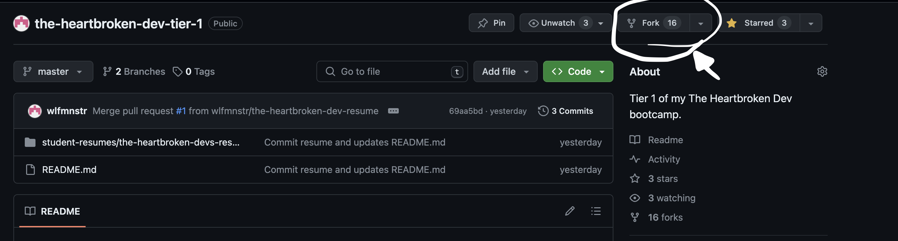
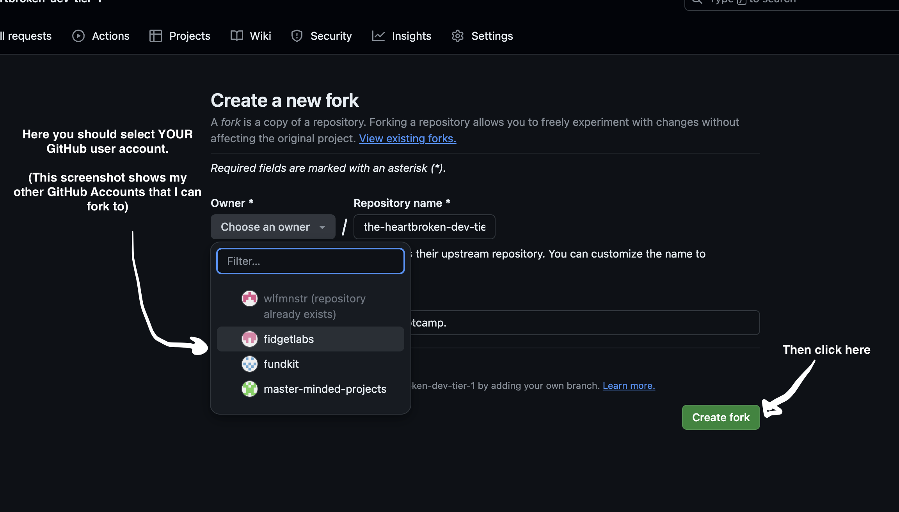
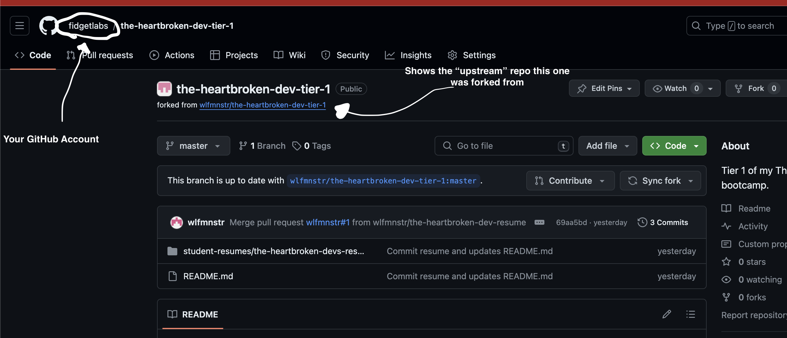

## Welcome

Welcome Students to the Tier 1 of The Heartbroken Dev’s full-stack software engineering curriculum!!

This is the first of several instructor led tiers which are specifically designed to give students the ability to build and deploy full stack software applications from scratch in 2024 and beyond.

If you’re here, you’ve already completed pre-work. That pre-work, for many of you was your very first taste of writing anything that even remotely resembled computer code. I cannot begin to describe just how awesome this is…

Whether you are starting from zero or have a decade of experience under your belt, the fact that you are here right now in tier 1 represents a willingness to be vulnerable and learn something new. It represents a willingness to take a chance on yourself.

Things that you should be EXCEPTIONALLY proud of yourself for doing…

Things I’m exceptionally proud of you for doing…

Tl;dr - I love you all, and it means the world to me that you’re here. Okay, on to the code…

## What you’ll Learn

**In this tier we will focus on these 3 things:**

1. Setting up your machine to successfully write full-stack javascript code and complete the curriculum.
2. Setting up some accounts in free services we will be using to deploy software throughout the course.
3. Getting a primer on the Javascript programming language and writing your first working javascript code.

## 1. Getting You Computer Setup for Javascript Development

>[!TIP] Do ALL of the steps in this section
>You may have done some of the steps to setup your machine and accounts which are detailed below during your pre-work assignments or in life before The Heartbroken Dev’s Bootcamp.
>
>However, each student should read through and understand each of these steps to ensure their machine is setup the way this curriculum is expecting.
>
>Future you thanks you for doing these things :)

### 1. GitHub Setup

1. **Create and/or Login to your GitHub Account:**
	1. If you do not have a github account, head to: https://github.com/signup and create an account. Choose a username you wouldn’t mind a future employer or colleagues seeing.
	2. If you already have a github account, login and return to this page once you’re logged in.

### 2. Terminal Setup

*Mac Instructions:* Your machine should come with an application called “Terminal” - just confirm you have this app installed and can open it.

1. Use Spotlight (cmd + space) to search for “terminal"
2. Open the app.
3. Come talk to me if you can’t find the app.

*Windows Instructions:* 

#### Native Command Prompt (Shell)

Your system comes with a program called “Command Prompt.”

1. To access it, click on the Start menu or press the Windows key.
2. Type `cmd` into the search bar and press Enter.
3. The Command Prompt should appear in the search results. Click on it to open.
	1. Alternatively, you can also find it by navigating to Start > All Programs > Accessories > Command Prompt.
4. If you have trouble finding or opening Command Prompt, it’s possible to download and install Windows Terminal from the Microsoft Store for a more modern experience.
	1. Go to the Microsoft Store app on your PC and search for “Windows Terminal.”
	2. Select the app from the search results and click on the “Get” button to download and install it.
5. Once you have either Command Prompt or Windows Terminal open, you're ready to proceed with the necessary commands or operations.
6. If you encounter any issues opening Command Prompt or Windows Terminal, please reach out for assistance.

#### Windows Subsystem for Linux
Alternatively you can install the windows subsystem for linux to be able to run a shell and have an environment more similar to mac.

1. Enable the WSL by going into the control pannel / settings and then select Apps (or it might be named Programs).

2. Select "Programs and Features"

3. Enable the 

4. Scroll down and enable the Windows Subsystem for Linux

5. This will ask you to reboot, say yes.
6. After you reboot, run a admin powershell by typing it in the search bar next to the start menu and right clicking it from the list "Run as administrator"
7. This opens up a PowerShell. Type `wsl --install -D Ubuntu`. This will download the distro and prompt you for a username and password to use in your WSL environment.
8. Type `wsl` from a PowerShell to run the default shell.
9. Git will already be installed. You can install node with `sudo apt install nodejs`

### 3. Install Git

First, some quick vocab for y’all:

- **VCS:** “Version Control System” - A VCS is a tool to help keep track of versions of things, typically versions of code.
	- As an example, you might use a VCS tool to help you save an original copy of the HTML file you created for your resume in the pre-work assignment then use it to help you manage updates to your resume file as you modify that file over time.
	- VCS tools commonly provide a way to “commit” new changes, “clone” existing codebases, create variations of code and keep them separate in “branches”, and all sorts of other fun things we’ll learn about when we dig in to Git a bit later.
- **Git:** is an open source VCS. Think of it like a program that runs on your computer that you can use in your coding projects to help manage versions of that project.
	- Managing versions of code becomes especially important the more iterations the code goes through, the more complex/large the codebase becomes, and the more people you have working on it.
	- Git is the most common VCS for code today, by a large margin.
	- We will have a section in a-bit digging in and understanding Git.
	- Git is NOT GitHub.
        - Git Bash is the name for the command-line terminal environment
	- Read about git here: https://git-scm.com/
- **SCM:** “Source Code Manager” - A SCM is a tool to help *manage* source code. In particular, to help manage the sharing and using and collaboration on source code.
	- GitHub is an example of an SCM (and the most popular in use by software engineers today).
- **GitHub:** GitHub.com is a for profit company, owned by Microsoft, who provides Source Code Management services for its customers (amongst other services now too).
	- GitHub store Git Repositories for us in a centralized place (the “cloud”).
	- It enables multiple people to collaborate on the same codebase and help make the processes of merging different peoples changes into the codebase more seamless and error free.

**Okay, now we’ll install Git - the Version Control System - on our computers…**

1. Head to https://git-scm.com/
2. Click on “Downloads”

3. Download the version for your Operating System (Windows, Mac, Linux).
	1. Click the Download icon for your OS under the “Download” banner.
		1. DON’T download the GUI shown lower on the page.
	2. This will download an installer, when finished, open and run the installer, following its instructions and using the default settings.

Let me know if you have problems installing Git.

### 4. Install Node.js

First, some more vocab for you!

- **JavaScript:** - A programming language that runs in web browsers (and elsewhere in 2024). It sounds like Java, but its a totally different programming language. It was invented back in the Netscape Navigator days and has seen a ton of changes and innovations over the last few decades. Fans of the language might refer to it as “The language of the web.” Like other programming languages, its purpose is to allow people to write in human-readable ways instructions for computers to follow. The interactivity and dynamic features of modern web pages use javascript to code that interactivity.
- **Client:** - A term used to describe the other half of the “client-server” model of computer networks.
	- Clients make requests and receive responses from Servers.
	- Web Clients typically fetch HTML, CSS, and Javascript files the web servers.
		- Your web browser (Chrome, Safari, Firefox, Etc.) is an example of a type of client you would call a “Web Client”.
	- Email Clients are another example of a Client.
		- The “Mail” app on an iphone is an example of an Email Client, it sends and receives data to and from Email Servers like Gmail, Yahoo Mail, and others.
	- A client could be just the “front-end” of the client-server model, your laptop might be drawn as the “client” on some diagrams.
	- A client can also be more specific, like the example of applications running on your computer/smartphone/etc like mail, chrome, etc…
- **Server:** - A term used to describe the “back end” of the client-server networking model. Its just like any other computer, because any computer can be a server, and all servers are computers. Servers serve assets to typically many clients, its their main job to handle often LOTS of requests from LOTS of clients at the same time.
- **Web Browser** - An application which fetches web pages from web servers, traditionally in the form of html, css, and javascript files.
	- Web browsers then handle the rendering of these html, css, and Javascript files (because looking at `<h1>Hello World<h1>` would get pretty old, pretty fast for most of us.
	- Google Chrome is a web browser. So is firefox, mobile safari, etc.
	- Web browsers act as the client-side and front-end of the client-server model of the web.
- **Web Server:** - A term used to describe the “back end” of the client-server networking model typically used on the web. Web servers are just computers like all other computers. They run applications that handle receiving requests (often lots of them simultaneously) and sending out the appropriate responses (files or data).
	- Examples of common web server applications are: nginx, Apache HTTP Server, several others you’ve probably never heard of, and the one we are going to work with in this course: Node.js
	- Think of a web server as a computer, running an application that a web client can talk to.
	- When you host a website (like your resume if you completed the challenge mode), you are saving your html file on a web server.
	- When you visit a website, your browser, acting as the client, makes a request to the web server hosting the HTML, CSS, and Javascript files for that website - saying: “hey, show me the www.google.com files please”. The server responds with those files and they are then rendered on your screen (if all goes according to plan anyway).
- **JavaScript Engine:** - Your web browser needs a way to execute the javascript files it receives. Javascript Engines are what they use to do this. It goes something like this:
	- JavaScript code - something that’s fairly human readable - ends up in your browser and first needs to be turned into instructions the browser and computer can understand (0’s and 1’s). This is called compilation - turning human readable code into machine readable instructions.
		- There’s a notion of line-by-line compilation (rather than whole-file compilation) that’s called “interpretation”.
		- We call Javascript and “interpreted” language.
			- Technically, modern Javascript engines use a process called “Just-in-time” compilation, or JIT, but we’re way in the weeds and you don’t need to know any of this right now.
		- A popular (the most popular probably) Javascript engine is the Google V8 Javascript Engine. Its what runs in chrome and lots of other browsers and handles the interpretation/compilation of javascript into code your browser can then execute. It then also executes that code.
	- JavaScript NEEDS a Javascript Engine to run. For the first decade+ of Javascript’s lifetime, this meant it could only run in browsers with a working Javascript Engine.
	- Then came Node.js in 2009…
- **Node.js:** Node.js (or just “Node”) is a cross-platform (it can run on windows, mac, linux, and others) “JavaScript Runtime Environment”. It uses the Google V8 engine to run Javascript outside of the browser. Tl;dr - “back-end” applications like web servers can now be written in JavaScript.
	- Although not technically the first way to run javascript outside of the browser, it was the first that also ran well at web-scale and could handle lots of requests simultaneously.
	- Here’s the wiki: https://en.wikipedia.org/wiki/Node.js

Tl;dr - Node.js is how we run javascript on the “back-end” and what we will be using to build full stack apps in this curriculum. It lets us learn one programming language that we can use across the stack.

Okay, now on to the install. This part is actually pretty easy. 
1. Head to https://nodejs.org/en/download and download the LTS version for your operating system and hardware. It SHOULD be auto selected for your correct computer, but double check before downloading.
2. Open the installer that is downloaded and follow the steps to install node.
3. That’s it! Let me know if you get stuck!

### 5. Installing a Code Editor (VSCode)

Hopefully everyone completed this as part of pre-work, but I will post some basic instructions here regardless. If folks need a more in-depth guide or walkthrough of setting up and using VSCode and cannot find answers in the existing content on The Heartbroken Dev discord or from the community there, let me know.

Do these things if you didn’t install VS Code yet, as this is the editor I’ll assume you’re using for the remainder of this course.

1. Head to https://code.visualstudio.com/
2. Click the download button (it should be set for you os and processor type, but double check to make sure you download the right one).
3. Then follow the instructions for installing the editor on your given operating system found under setup on this page: https://code.visualstudio.com/docs/setup/setup-overview

By all means, play around with VSCode and get familiar with it! Its an awesome piece of software that is almost infinitely extensible with its massive library of installable extensions, and it comes pretty great out of the box.

### 6. Fork this repository

Okay now we’re getting fancy and learning how to use this SCM stuff that we talked about earlier with GitHub.

We are going to “Fork” **this** repository. Some of you may know what this means, and others it may be totally foreign. That’s great! 
- Forking is how you can clone / copy a repository that is outside of your GitHub account, into your github account. 
- This will give you a "forked" copy of the repository that is now effectively totally your own repository.
- You can make any changes you want to your fork without impacting the repository you forked from (my repository in this case).
- The repository you forked from is called the "upstream" repository.
- Forks keep track of the upstream as well, so as the original repository changes, or your repository changes, you will see on your repo how much "ahead" or "behind" the upstream repo your forked repo is. (this is cool if you are trying to make changes that you eventually want to request be incorporated into the upstream repo - a process we'll cover in just a bit!)

**Here's how to do this:**
1. assuming you are logged in to github as detailed in the earlier steps,from the main page of my repository for this tier-1 content (where you're probably reading this right now, but the url is [https://github.com/wlfmnstr/the-heartbroken-dev-tier-1](https://github.com/wlfmnstr/the-heartbroken-dev-tier-1)) click the "fork" button. Here's a screenshot:

2. Follow the prompts to fork it to YOUR github account. Another screenshot: 
3. When you click "create fork" it will redirect to your account, it sometimes takes a second to complete this step. You should have something that looks like this: 

### 7. Upload your Resume on YOUR Fork

Now, we're going to practice collaborating on a github repository.

On YOUR new forked repository (NOT MINE, use the one in your github account that you just created in the previous steps) - you are going to create a directory for your resume files and upload them.

The right way to do this is to first CLONE the repository (again, clone your fork, not my upstream original repo). Here are the steps to do this:

1. Coming soon.... 